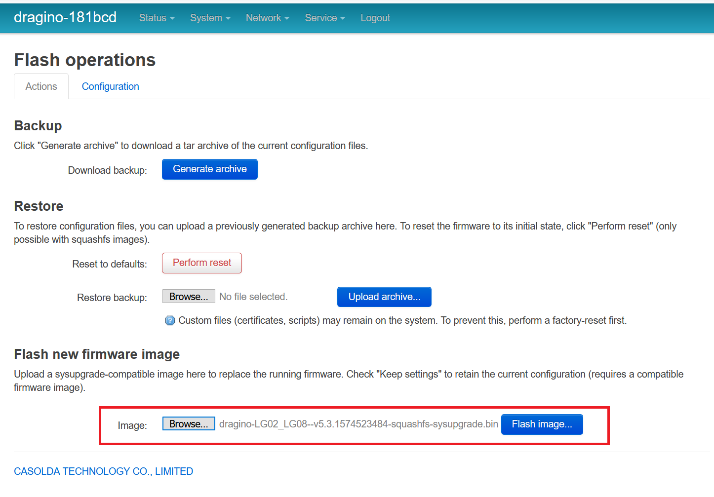
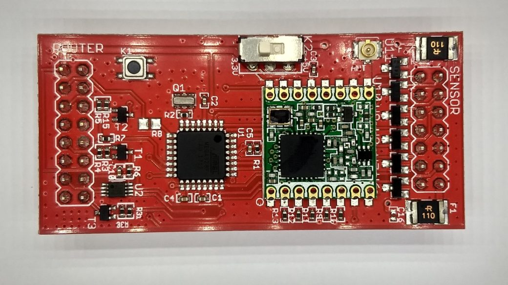
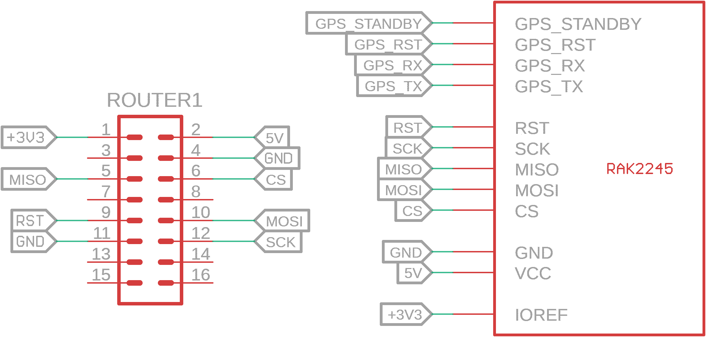
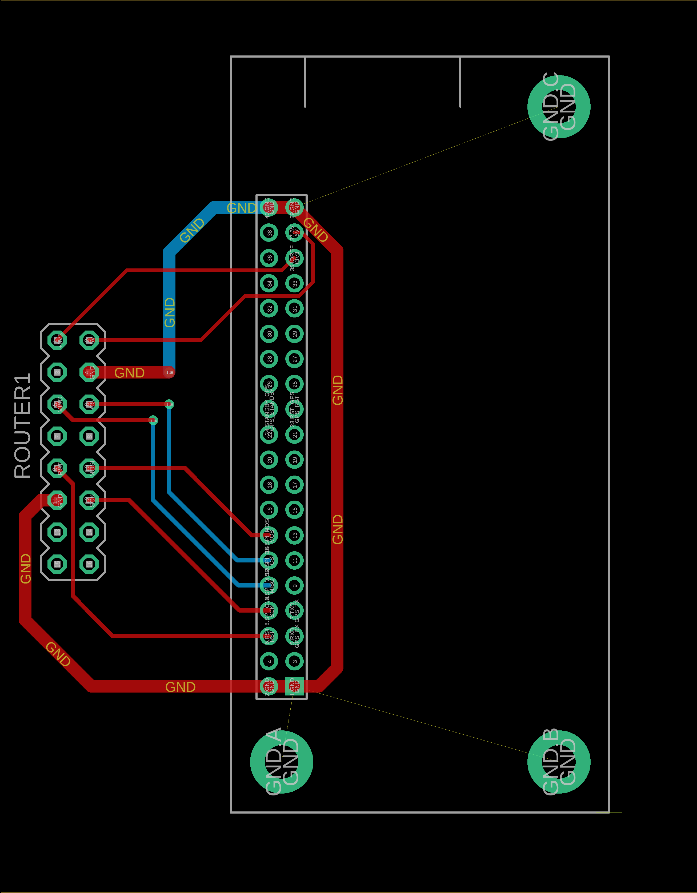
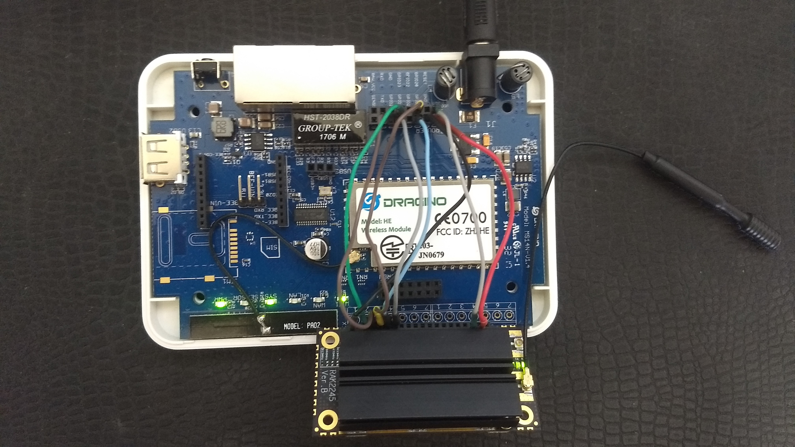
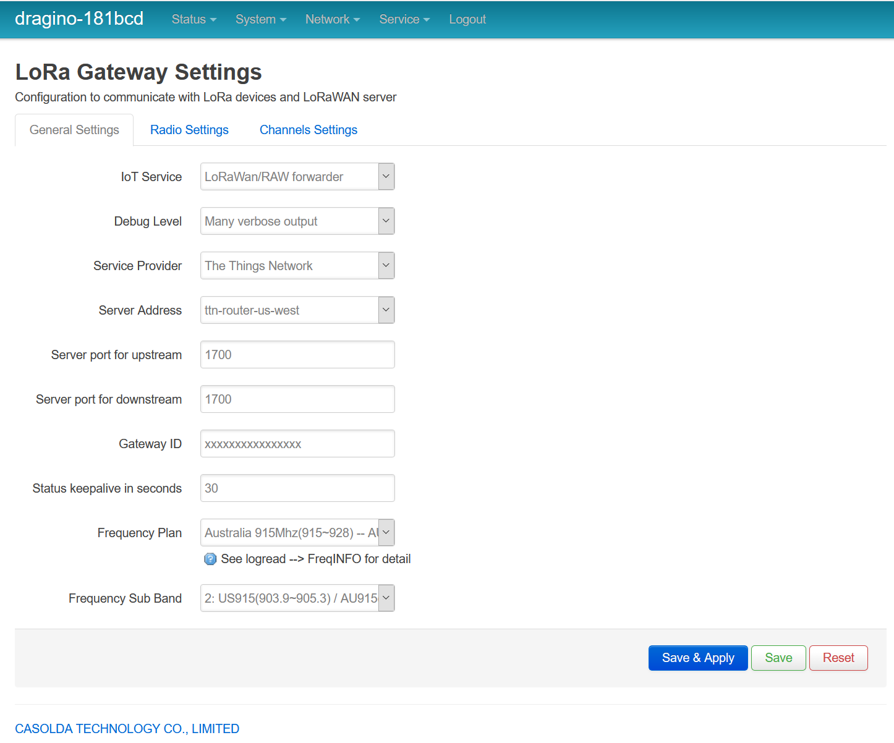

# lg01-update
Dragino LG01 gateway update to 8 channels

## Update Firmware

First you need to update the firmware: 
* Download [here](firmware/dragino-LG02_LG08--v5.3.1574523484-squashfs-sysupgrade.bin) or [Dragino Firmware Release][1]

### Upgrade Firmware via GUI

System -> Backup / Flash Firmware

Select the firmware and flash the new image, uncheck the `"Keep settings"` to remove the setting of the old firmware.

If you have some problem check the [Dragino Wiki][2]

## Concentrator RAK2245

First remove the main LG01-router.

The connection between the LG01 and RAK2245 should be like the schematic.

`The RAK2245 requires the IOREF connected to the 3.3V to works.`

I did not test other concentrators but should work as the same, just connect the SPI on the right pins!

## TTN

Service -> LoRaWan Gateway

Select the `Frequency Plan` for your concentrator and the `Gateway ID`.

Your gateway is ready and upgraded to 8 channels.

----

See news and other projects on my [blog](http://loranow.com)

Do you like this library? Please [star this project on GitHub](https://github.com/ricaun/lg01-update/stargazers)!

[1]: http://www.dragino.com/downloads/index.php?dir=LoRa_Gateway/LG01N/Firmware/Release/
[2]: https://wiki.dragino.com/index.php?title=Upgrade_Firmware_ms14